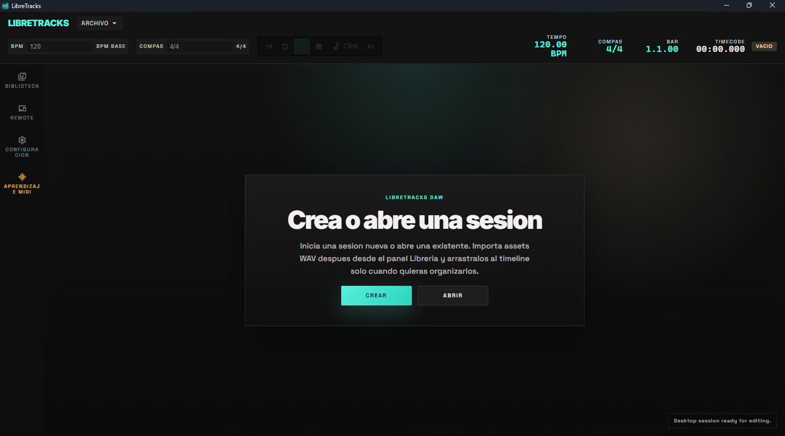
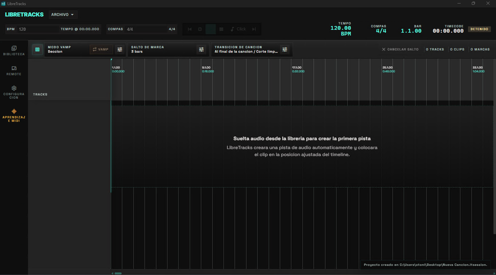
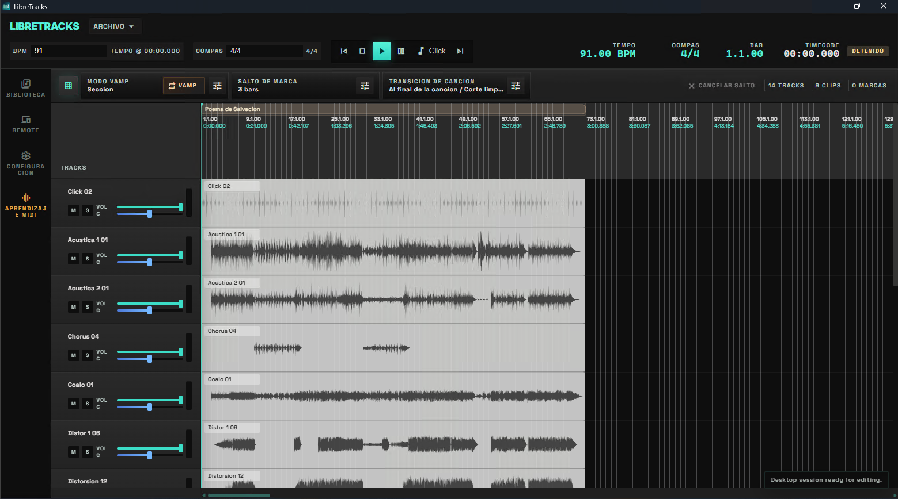

# LibreTracks


LibreTracks es una DAW y estación de reproducción multitrack para directo, construida con un stack de audio en Rust y una shell de escritorio en React/Tauri. El monorepo actual está centrado en edición no destructiva, saltos musicales entre secciones, importación de WAV y un runtime de escritorio que separa claramente la UI de la lógica de audio.

## Novedades de v0.0.3

- Entrada MIDI y aprendizaje MIDI: selecciona un dispositivo, refresca la lista, asigna notas o CC a acciones en vivo y conserva los mapeos en los ajustes.
- Metronomo integrado: envia una claqueta sintetizada a Master o a cualquier salida externa activa con control de volumen propio.
- Vamp y saltos de cancion: repite la seccion actual o un numero fijo de compases, dispara saltos entre canciones y elige transicion inmediata o con fade out.
- Remote mejorado: el control movil incluye transporte, salto, vamp, transicion de cancion y mixer en una interfaz mas adaptable.
- Importacion de canciones/sesiones: importa paquetes de LibreTracks
- Mejoras de timing musical: compases, planificacion de saltos, fade/declick al detener y ajustes visuales para un directo mas estable.

## Capturas de pantalla
| Captura | Captura |
| --- | --- |
| Inicio<br> | Sesion vacia<br> |
| Proyecto<br> | Conexion remote<br> |
| Mixer remote<br> |  |


## Architecture Overview

LibreTracks se divide en dos capas principales:

- `apps/desktop` es el frontend de escritorio. Usa React, stores con Zustand y renderizado por canvas para el timeline, el ruler, las marcas y las formas de onda.
- `apps/desktop/src-tauri` es el puente nativo. Expone comandos Tauri, mantiene el estado desktop, aplica ajustes de audio y conecta la UI con el runtime en Rust.
- `crates/libretracks-core` contiene el modelo de dominio y las validaciones de canciones, tracks, clips, marcas, buses y tempo.
- `crates/libretracks-audio` contiene la lógica de transporte y mezcla. Resuelve clips activos, ganancia efectiva por pista, `play`/`pause`/`seek`/`stop`, metronomo, vamp, transiciones de cancion y saltos musicales.
- `crates/libretracks-project` gestiona persistencia de proyecto, `song.json`, assets de librería, importacion de paquetes LibreTracks e importación/probing de WAV mediante `symphonia`.
- La salida de audio nativa del escritorio usa `cpal` para I/O del dispositivo. La decodificación y lectura de metadatos WAV se resuelve mediante `symphonia` en la capa de proyecto/importación.

Esta separación es intencional: el frontend decide cómo presentar y editar la sesión; Rust mantiene las reglas del transporte, la persistencia, la validación y el comportamiento de audio.

## Prerequisites

El flujo desktop asume estas dependencias instaladas:

- Node.js `>= 20`
- Rust stable toolchain con `cargo` y `rustc`
- Microsoft Visual C++ Build Tools en Windows
- Windows 10/11 SDK en Windows para el enlazado MSVC

Para ejecutar el target nativo en Windows, `scripts/desktop-native.ps1` comprueba el linker de MSVC y las librerías del SDK. En la práctica, necesitas Visual Studio Build Tools con la carga `Desktop development with C++` antes de ejecutar la app Tauri nativa.

## Getting Started

Instala las dependencias desde la raíz del repositorio:

```bash
npm install
```

Comandos útiles a nivel raíz:

```bash
# UI desktop en modo Vite
npm run dev:desktop

# App de escritorio completa con Tauri + Rust
npm run dev:desktop:native

# Bundle de producción del frontend desktop
npm run build:desktop

# Tests Rust del workspace
cargo test
```

Otros comandos útiles durante desarrollo:

```bash
# Chequeo nativo de Rust mediante el script helper de Windows
npm run check:desktop:native

# Tests frontend y lint/typecheck
npm run test:desktop
npm run lint

# Tests Rust desktop en Windows CI o en equipos sin hardware de audio
LIBRETRACKS_DUMMY_AUDIO=1 cargo test --locked -p libretracks-desktop -- --test-threads=1
```

Cuando `LIBRETRACKS_DUMMY_AUDIO` vale `1` o `true`, el runtime de audio desktop omite la deteccion de dispositivos con `cpal` y usa el backend nulo de reproduccion que ya existe. Esto esta pensado para la CI headless en Windows, donde WASAPI puede fallar si no hay hardware de audio disponible.

Ese comando de tests tambien fuerza `--test-threads=1`. Asi evitamos flakiness cuando los fixtures WAV temporales usan `memmap2`, de modo que los archivos mapeados se liberen de forma predecible antes de que Windows destruya el directorio temporal.

## Control Remote (Desktop + Movil)

LibreTracks ahora incluye un flujo de acceso remoto integrado en la UI desktop:

1. Abre `Remote` desde la navegacion lateral.
2. En la tarjeta `Conectar remote movil`, escanea el codigo QR o abre una de las URLs generadas (`IP` o `hostname .local`) desde el navegador de tu movil/tablet.
3. Asegurate de que desktop y movil esten en la misma red.

La superficie web remota refleja acciones en vivo desde desktop y expone controles de transporte, controles de salto y una vista dedicada de mixer para ajustes rapidos de volumen/mute/solo durante ensayos y show.

El remote tambien expone los controles nuevos de directo: `Vamp`, ajustes de salto de marca, ajustes de salto de cancion y modo de transicion de cancion. Es util como superficie compacta cuando el operador desktop necesita seguir centrado en el timeline.

## Project Structure

```txt
.
├─ apps/
│  ├─ desktop/             Aplicación principal de escritorio con React + Tauri
│  │  ├─ src/              UI, stores Zustand, i18n y renderizado canvas del timeline
│  │  └─ src-tauri/        Host nativo Tauri, comandos, runtime de audio y wiring con CPAL
│  └─ remote/              Cliente web remoto para superficies de control secundarias
├─ crates/
│  ├─ libretracks-core/    Modelo de dominio compartido, validación y tipos base
│  ├─ libretracks-project/ I/O de proyecto, persistencia de canción e importación WAV con Symphonia
│  ├─ libretracks-audio/   Motor lógico de audio, transporte, activación de clips y saltos
│  └─ libretracks-remote/  Protocolo remoto y utilidades backend
├─ docs/                   Notas de arquitectura, depuración y roadmap
├─ samples/                Material de ejemplo y canciones demo
├─ scripts/                Helpers de desarrollo, incluido el bootstrap nativo de Windows
├─ tests/                  Superficies e2e e integración
├─ Cargo.toml              Manifest del workspace Rust
└─ package.json            Manifest del workspace JavaScript y scripts raíz
```

## Notas para Desarrollo

- La app es WAV-first en el estado actual del proyecto.
- El routing de pistas parte de los buses `main` y `monitor`.
- El transporte soporta saltos inmediatos, saltos a la siguiente marca y saltos cuantizados por compases.
- Las etiquetas de UI salen de `apps/desktop/src/shared/i18n/en.ts` y `es.ts`; la documentación debe reutilizar esos textos exactos al describir la interfaz.
