# Manual de Usuario de LibreTracks

LibreTracks está pensado para directores musicales, playback engineers y músicos que necesitan un entorno multitrack fiable para el directo. La app mantiene la edición no destructiva y separa el motor de audio de la UI en React, para que organizar, guardar y lanzar una canción no dependa de modificar el audio original.

> ⚠️ Consejo de directo: prepara el show con antelación, guarda la sesión y ensaya los saltos con el mismo dispositivo de salida que usarás en escenario.

## 1. Introducción

LibreTracks te permite importar audio, organizarlos en un timeline y disparar saltos musicales entre secciones durante la reproducción.

Por qué es seguro para directo:

- La edición es no destructiva. Los audios originales no se reescriben al mover o cortar clips.
- El runtime desktop mantiene el motor de audio desacoplado de la capa de UI.
- Comportamientos como `Inmediato`, `En la siguiente marca` y `Tras X compases` se resuelven en la lógica Rust del transporte, no con temporización improvisada en la interfaz.

## 2. Configuración de Audio

### Abre `Configuracion`

1. Abre `Configuracion` desde el panel lateral.
2. En el panel de audio, elige el `Dispositivo de audio` correcto.
3. Verifica la salida antes del ensayo y antes del show.

Si dejas `Dispositivo de audio` en `Predeterminado del sistema`, LibreTracks seguirá la salida por defecto del sistema operativo. En directo, normalmente es más seguro usar una interfaz dedicada.

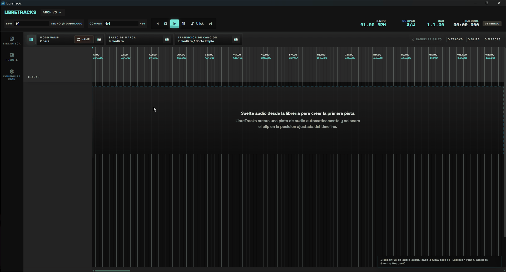

### Configura salidas de hardware

Activa los canales de hardware que quieras usar en `Configuracion > Audio`. Cada pista puede rutear a `Master` o directamente a salidas `Ext. Out` mono y pares estereo desde la cabecera de la pista.

Uso tipico en escenario:

- Envia stems y playback musical a `Master`.
- Rutea click, count-ins, cues habladas o guias directamente a una salida externa de cue.
- Mantén las salidas de cue independientes del fader de Master.

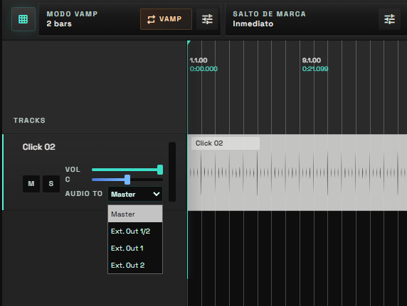

### Usa el `Metronomo` integrado

Activa `Metronomo` desde `La barra superior` cuando necesites una claqueta fiable sin importar un archivo de audio aparte. Elige la salida del metronomo en ajustes y ajusta `Volumen del metronomo` antes del ensayo para colocarlo bien en la mezcla de cue.

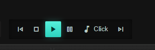

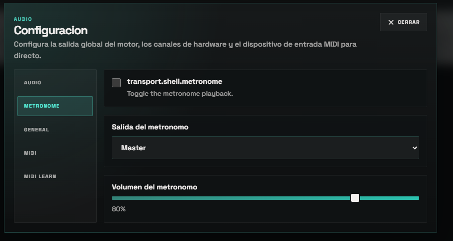

### Conecta hardware MIDI

En `Configuracion`, elige un `Dispositivo de entrada MIDI`, por ejemplo una pedalera, un controlador de pads o un teclado. Usa `Refrescar dispositivos MIDI` si conectaste el controlador despues de abrir LibreTracks.

Abre `Aprendizaje MIDI` para asignar notas o mensajes CC del hardware a controles en vivo. Son mapeos utiles `Reproducir`, `Detener`, `Vamp`, modos de salto de marca, disparadores de salto de cancion, modo de transicion de cancion y controles de numero de compases.

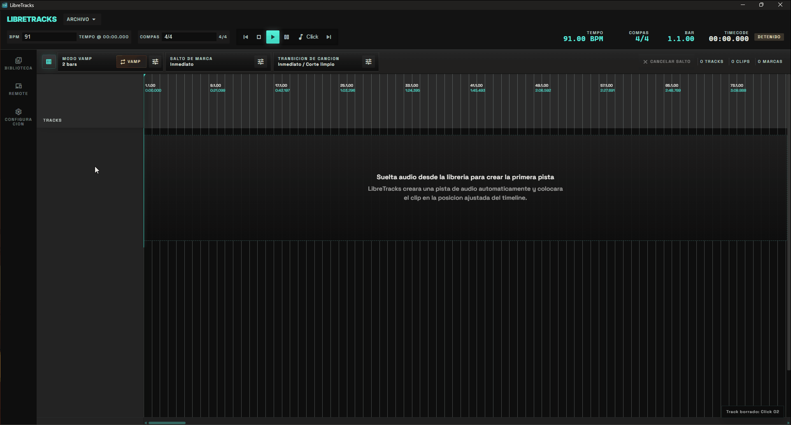

## 3. Organización del Proyecto

### `Biblioteca`

Usa `Biblioteca` como el área de preparación de assets del show.

1. Abre `Biblioteca`.
2. Pulsa `Importar audio`.
3. Selecciona uno o varios archivos de audio.
4. Arrastra esos assets al timeline cuando quieras empezar a organizar.

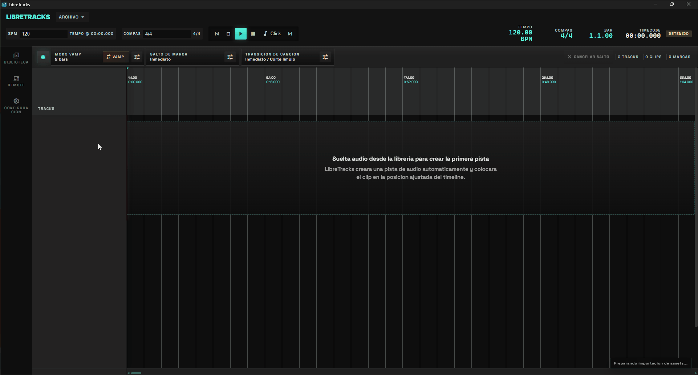

`Crear carpeta virtual` te permite agrupar assets por set, escena, sección o instrumentación sin mover los archivos fuente originales. Un enfoque práctico es usar una carpeta virtual por canción o por bloque del show. Puedes crearla haciendo click en la sección `Sin Carpeta`

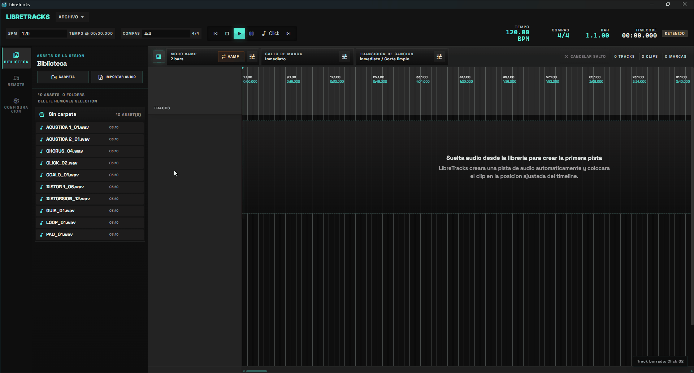

### `Audio track` vs `Folder track`

- `Audio track` es la pista donde viven y suenan los clips.
- `Folder track` sirve para organizar y controlar de forma conjunta las pistas hijas.

Usa `Folder track` cuando quieras agrupar stems, por ejemplo batería, tracks de banda, coros o playback auxiliar. Usa `Audio track` cuando necesites una lane que realmente contenga clips.

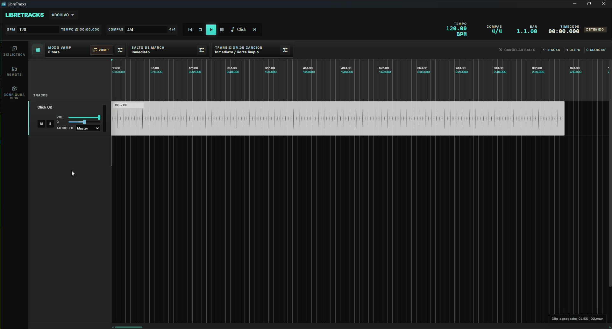

## 4. Edición Básica (Timeline)

LibreTracks mantiene el timeline directo y orientado a directo.

### Añadir y mover clips

- Arrastra assets desde `Biblioteca` al timeline.
- En una sesion vacía, soltar desde `Biblioteca` crea automáticamente la primera `Audio track`.
- Mueve un clip arrastrándolo a una nueva posición del timeline.

### Duplicar clips

- Haz clic derecho sobre el clip.
- Elige `Duplicar`.

Esto va bien para loops, repeticiones y partes de apoyo que vuelven más adelante en la canción.

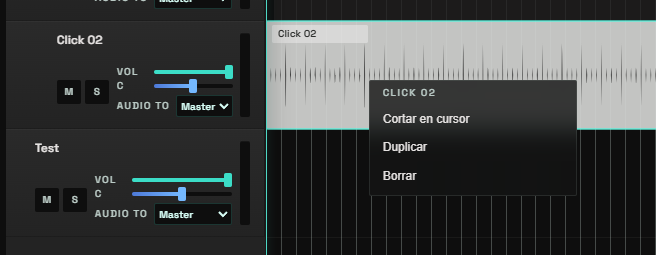

### Cortar clips

1. Lleva el cursor o playhead al punto de corte.
2. Haz clic derecho sobre el clip.
3. Elige `Cortar en cursor`.

Es la forma más rápida de ajustar la estructura sin tocar el WAV original.

### Usa `Snap to Grid`

Mantén `Snap to Grid` activado cuando quieras que clips, cursor y ediciones caigan sobre divisiones musicales. Desactívalo solo cuando necesites colocar algo libremente fuera de la rejilla.

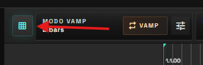

## 5. Control en Vivo: Navegación y Saltos

### `Secciones/Canciones`

Las secciones definen una canción en el timeline

Crea secciones desde el header del timeline:

1. Selecciona la region para crear la canción
2. Click derecho sobre la región 
3. Crear canción desde selección

Una vez creada podrás renombrarla o borrarla

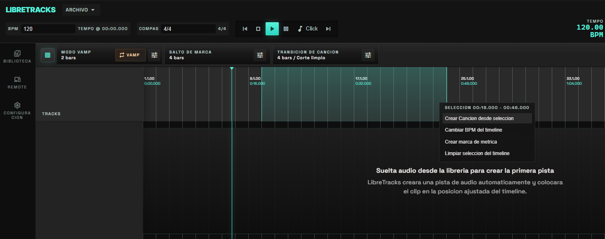

### `Marcas`

Crea secciones desde el ruler:

1. Haz clic derecho sobre el ruler.
2. Elige `Crear Marca`.
3. Renombra la marca si lo necesitas.

LibreTracks puede mostrar marcas con prefijo numérico, por ejemplo `1. Intro`. En la build desktop actual, los atajos `0-9` se resuelven por orden de marca en el timeline: `0` apunta a la primera marca, `1` a la segunda, y así sucesivamente.

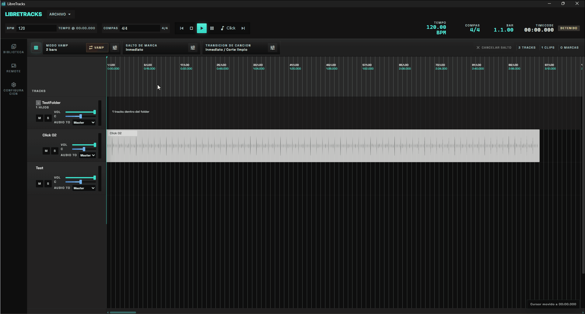

### `Cambio de Tipo de Compas`

Puedes cambiar el tipo de compas en el timeline para ello:

1. Haz clic derecho sobre el header del timeline.
2. Elige `Crear Marca de Metrica`.
3. Selecciona la nueva metrica con formato 4/4 3/6 4/8.

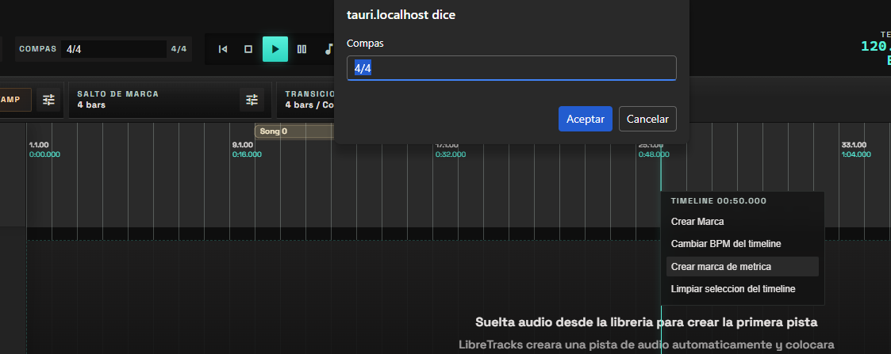

### Modos de `Salto`

Configura el comportamiento global desde `Salto`:

- `Inmediato`: salta al instante.
- `En la siguiente marca`: espera al siguiente límite de sección y salta allí.
- `Tras X compases`: cuantiza el salto para que ocurra tras el número de compases configurado.

Esto te permite reaccionar en tiempo real si la banda alarga un estribillo, se salta un puente o necesita repetir una sección.

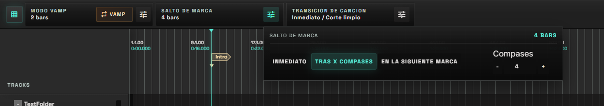

### `Vamp`

Usa `Vamp` para mantener la reproduccion en un bucle musical cuando la banda o la accion de escenario necesita mas tiempo. `Modo Vamp` puede repetir la `Seccion` actual (Las esccines están delimitadas por los marcadores) o un nume-ro fijo de `Compases`. Pulsa `Vamp` de nuevo para salir del bucle.

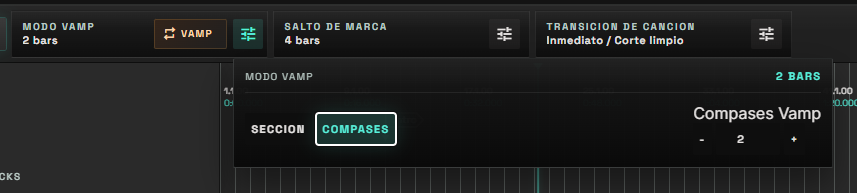

### Saltos de cancion y transiciones

Usa los controles de `Salto de Cancion` cuando la sesion contiene varias regiones de cancion y necesitas moverte a otra zona durante la reproduccion. El disparador puede ser inmediato, tras un numero configurado de compases o al final de la cancion/region.

`Transicion de Cancion` controla como pasa la cancion actual a la siguiente:

- `Clean cut`: cambia directamente.
- `Fade out`: desvanece la reproduccion actual antes del salto.

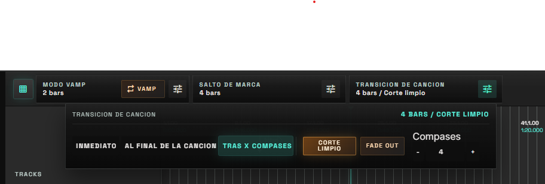

### Arreglos de canción

Un arreglo cambia la forma de una canción sin montar saltos: dos coros más al final, quitar el puente, repetir el verso. El arreglo se escribe en el timeline tal cual (si repites el verso, ves el verso dos veces) y las canciones de después se desplazan solas.

1. **Marca las secciones** de la canción (Intro, Verso, Coro…) en la fila de secciones del ruler, como siempre. Hacen falta al menos dos. Las marcas de aviso (Build, Entra batería…) no cortan secciones: viajan con la sección en la que están.
2. Haz click derecho sobre la canción y elige `Arreglo` (en la vista compacta, en el menú de la canción).
3. Pulsa `Guardar como original`. LibreTracks guarda la canción tal como está para poder montar cualquier arreglo y volver al original cuando quieras. Si alguna marca no cae en el primer tiempo de un compás, te avisa y te ofrece `Ajustar al compás`.
4. **Monta el arreglo**: arriba tienes las secciones de la canción. Haz click en una para añadirla al final, o arrástrala a la tira de abajo para meterla donde la sueltes. En la tira, arrastra los bloques para cambiarlos de orden, `Supr` quita el bloque seleccionado y `Ctrl+D` lo duplica.
5. Pulsa `Aplicar`. El timeline muestra el resultado y las canciones siguientes se colocan detrás, en su compás.

Puedes guardar varios arreglos de la misma canción (`Nuevo`, `Renombrar`, `Eliminar`) y cambiar de uno a otro desde el selector. `Original` devuelve la canción a como era; el arreglo no se borra.

Con un arreglo aplicado, la canción muestra `⇄ Domingo` (el nombre del arreglo) en el ruler, en la vista compacta, en la vista en directo y en el remote, y el ruler sombrea un poco las secciones que son repeticiones.

**Editar una canción con arreglo.** El volumen, el mute, el pan o las salidas de las pistas se cambian como siempre. Para mover, recortar o añadir clips o marcas, LibreTracks te pregunta antes: `Esta canción tiene un arreglo. ¿Editar el original?`. `Editar original` vuelve al original (el arreglo se guarda), editas lo que quieras y, al volver a pulsar `Aplicar`, el arreglo se monta sobre la canción editada. Si quitaste una sección que usaba algún arreglo, te dice de qué arreglos la ha quitado.

**En el móvil y la tablet** el editor ocupa la pantalla: los bloques son una lista vertical. Arrastra por el asa de la derecha para cambiar el orden, desliza a la izquierda para quitar (con `Deshacer` unos segundos), mantén pulsado para `Duplicar` o `Quitar`, y usa el botón `+` para añadir secciones.

Los arreglos viajan en los paquetes de canción (`.ltpkg`) y de sesión (`.ltset`). Si abres la sesión con una versión anterior de LibreTracks, verás el arreglo escrito en el timeline y sonará igual, pero si guardas desde esa versión se pierde el original del arreglo.

## Exportar canciones y paquetes

Puedes exportar una canción en caso de aberla creado con las regiones, esto exportará toda la configuración de la canción para tenerla disponible en futuras sesiones. Para ello:

1. Crea una canción con la seleccion de región
2. Haz click derecho sobre la región creada
3. Haz click en `Exportar Canción`

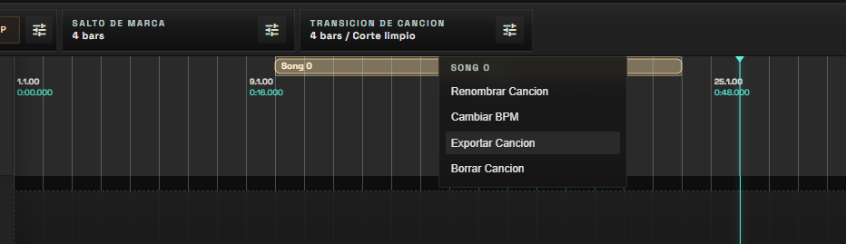

### Renderizar audio de una canción

Para mandar a cada músico su pista de ensayo (al batería todo menos la batería, al guitarrista todo menos las guitarras):

1. Haz click derecho sobre la canción (en el móvil, mantén pulsada la canción y abre el menú de la barra de selección; en la vista compacta, el menú de la columna).
2. Elige `Renderizar audio…`.
3. Marca las pistas que quieres dentro. Las carpetas tienen su propia casilla para marcar o quitar todas sus pistas de golpe.
4. Elige la salida:
   - `Mezcla (un archivo)`: todas las pistas marcadas en un solo WAV.
   - `Pistas por separado (.zip)`: un WAV por pista, todos alineados desde el inicio de la canción, dentro de un `.zip`.
5. Ajusta formato (WAV 16/24/32 bits), frecuencia de muestreo, estéreo o mono, y si quieres:
   - `Aplicar la mezcla`: volumen y paneo de cada pista y carpeta y el volumen de la canción, como suenan al reproducir. Desmarcado, todas salen a 0 dB y centradas.
   - `Normalizar`: deja el pico de cada archivo en -0,3 dB.
   - `Incluir el metrónomo` / `Incluir la voz guía`: con tu configuración actual. En pistas por separado salen como archivos propios.
6. Pulsa `Renderizar` y elige dónde guardarlo.

El render respeta el cambio de tono y el warp de la canción, y no depende de mute ni solo: sale lo que marques. Puedes seguir reproduciendo mientras se renderiza.

### Importar canciones y paquetes

Usa `Importar cancion` desde la sección `Archivo` en la parte superior cuando quieras traer otra cancion o paquete de sesion de LibreTracks a la sesion actual. Es util para construir un show a partir de canciones preparadas sin rehacer pistas y marcas a mano.

### Atajos

- `Espacio`: alterna `Reproducir` / `Pausar`
- `Esc`: cancela un salto pendiente
- `0-9`: arma un salto hacia la marca correspondiente
- `Shift + 0-9`: arma un salto hacia la canción seleccionada. El 0 se corresponde con la primera cación, 1 la segunda, 2 la tercera...

Si armas la sección equivocada, pulsa `Esc` inmediatamente. Si no existe una marca para ese hueco, LibreTracks avisará de que no hay una marca disponible para ese dígito.

## Vídeo

LibreTracks puede proyectar vídeos (letras, fondos, clips) sincronizados con el audio en una segunda pantalla: un proyector o una TV. El audio manda: el vídeo sigue al transporte, a los saltos, a los vamps y al warp, nunca al revés.

> Solo en escritorio. En Windows y en macOS (12 o posterior) funciona tal cual: la app trae lo necesario. En Linux hace falta tener instalado `libmpv` (paquete `libmpv2` o `mpv-libs` según la distribución). En Android e iOS las sesiones con vídeo se abren y suenan, pero el vídeo no se reproduce ni se puede editar.

### Añadir vídeo

1. Arrastra un vídeo (`.mp4`, `.mov`, `.mkv`, `.webm`…) desde el explorador al timeline o a la biblioteca. Si lo sueltas sobre una pista de audio, se crea una pista de vídeo al lado.
2. El clip de vídeo se mueve, recorta, divide, duplica y borra como uno de audio, y tiene fundidos de entrada y salida y su propio encaje (clic derecho).
3. Si el vídeo trae sonido, LibreTracks pregunta si quieres **extraerlo como pista de audio**: queda en una pista nueva justo debajo, alineada con el vídeo. Puedes marcar "Recordar mi elección", y hacerlo más tarde con clic derecho → `Extraer audio`.

### Configurar la pantalla

La primera vez que añades un vídeo se abre el **asistente**: eliges la pantalla (cada una muestra su número para que la reconozcas), compruebas que la carta de ajuste se ve en el proyector, eliges encaje y pantalla de reposo y, si quieres, calibras. Nada se guarda hasta pulsar `Listo`.

Todo se puede cambiar después en `Ajustes → Vídeo`: pantalla, pantalla completa o ventana, encaje (ajustar, rellenar, estirar), pantalla de reposo (negro o una imagen), qué mostrar al parar y decodificación por hardware. Si solo tienes un monitor, puedes usar el modo ventana mientras tanto.

Haz **doble clic en el vídeo** para pasar de pantalla completa a una ventana que puedes mover y redimensionar, y otro doble clic para volver. En pantalla completa el vídeo queda por delante de todo, incluidas las notificaciones; si prefieres que otras ventanas puedan ponerse delante, desactiva `Pantalla completa siempre delante` en `Ajustes → Vídeo`.

La ventana de vídeo solo se abre cuando la sesión tiene algún vídeo. Mientras la tenga, en la barra de arriba aparece un icono de cámara: haz clic en él para ocultar o volver a mostrar la ventana. Cerrar la ventana de vídeo equivale a apagar la salida, y el mismo icono la vuelve a encender.

El indicador de la barra superior dice en qué pantalla sale el vídeo y avisa si se desconecta. Al volver a conectarla, la imagen vuelve sola.

### Calibrar el retardo

Proyectores y TVs muestran la imagen con algo de retraso. En `Ajustes → Vídeo → Calibrar…`, con el metrónomo activo y en reproducción, la salida destella en cada pulso: mueve la compensación hasta que destello y clic coincidan. También puedes tocar 10 veces al ver el destello y 10 al oír el clic, y aplicar la compensación que te sugiere.

### Control en directo

| Acción | Atajo | También por |
| --- | --- | --- |
| Vídeo: negro (y vuelta) | `B` | MIDI learn, botón `Negro` del remote |
| Vídeo: fundido a negro | sin asignar | MIDI learn |
| Vídeo: mostrar reposo | sin asignar | MIDI learn |
| Vídeo: activar/desactivar salida | sin asignar | MIDI learn |

El negro no para nada: el vídeo sigue sincronizado por debajo y, al quitarlo, vuelve ya en su sitio. Mientras está activo el indicador muestra **VÍDEO EN NEGRO**. No se guarda: al reiniciar la app la salida arranca normal. Los atajos se cambian en `Ajustes → Atajos`.

### Formatos recomendados

- **H.264 en `.mp4`** con un fotograma clave por segundo (GOP de 1 s). Los saltos y vamps son inmediatos.
- Con fotogramas clave muy separados (más de 2 s), LibreTracks lo marca en la biblioteca: los saltos a mitad de un vídeo así pueden tardar un instante. Para reexportarlo con ffmpeg: `ffmpeg -i entrada.mp4 -c:v libx264 -g 30 -keyint_min 30 -c:a copy salida.mp4` (para 30 fps).
- HEVC, ProRes y VP9 funcionan; 4K necesita un equipo con decodificación por hardware.

### Paquetes con vídeo

Al exportar una canción (`.ltpkg`) o la sesión (`.ltset`) con vídeos, el diálogo avisa de cuántos hay y cuánto ocupan, con la casilla `Incluir los vídeos en el paquete`:

- Marcada: los vídeos viajan dentro del paquete (incluidos los de la biblioteca que no estén en el timeline) y se abren en otro equipo sin buscar nada.
- Desmarcada, o en modo Ligero: los vídeos no viajan; en otro equipo aparecen como archivos que faltan y se reubican.
- Si subes la sesión a la nube y los vídeos pasan de 500 MB, la casilla empieza desmarcada.

Al importar en Android o iOS los vídeos no se extraen (no se pueden reproducir allí), pero los clips se conservan: si la sesión vuelve a escritorio, se reubican los vídeos.

## 6. Control Remote Movil

LibreTracks desktop puede publicar una superficie web remota para controlar transporte y mixer.

### Conectar movil o tablet

1. Abre `Remote` desde la navegacion lateral en la app desktop.
2. En `Conectar remote movil`, escanea el codigo QR o abre una de las URLs mostradas:
	- `URL por IP`
	- `URL por hostname (.local)`
3. Verifica que desktop y movil esten en la misma red local.

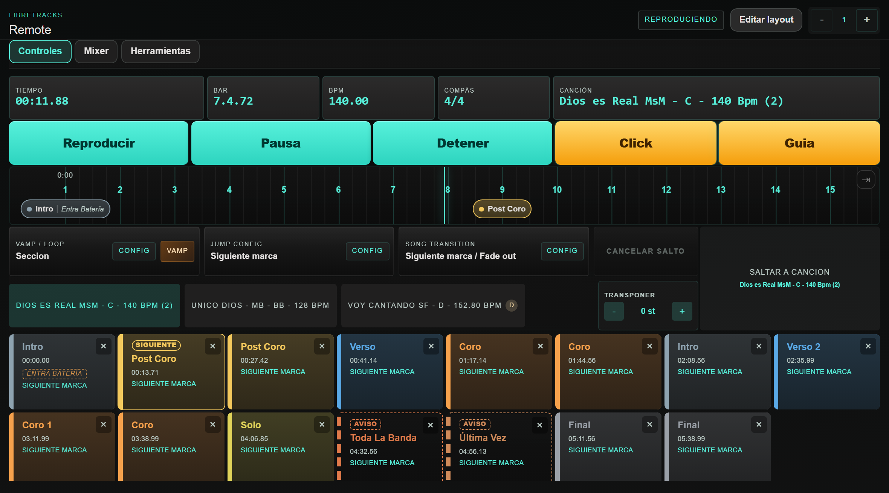

### Uso remoto en ensayo/show

- Usa controles de transporte (`Reproducir`, `Pausar`, `Detener`) desde el movil.
- Arma y cancela saltos desde remote cuando necesites adaptar secciones en vivo.
- Activa `Vamp`, ajusta saltos de marca/cancion y selecciona el modo de transicion de cancion desde el remote.
- Cambia a `Mixer` para ajustar volumen, paneo, mute y solo por pista sin tocar el desktop.

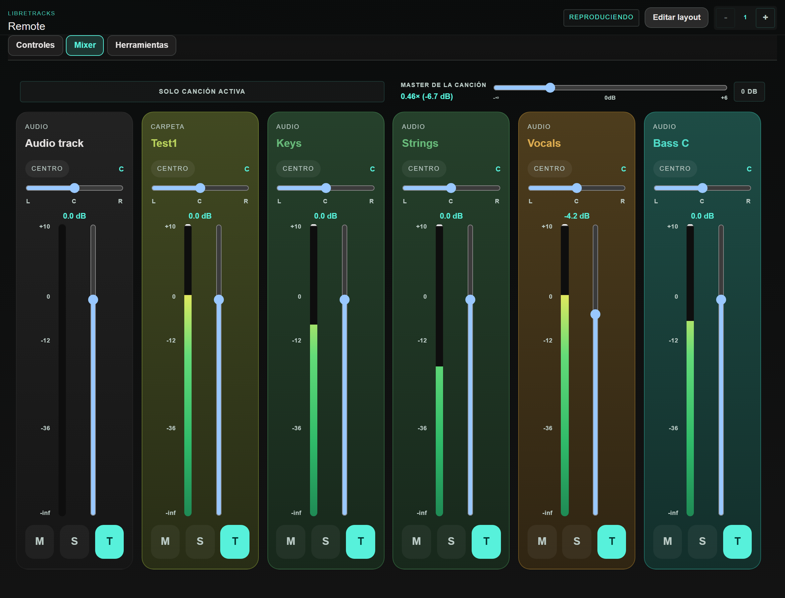

> Sugerencia de flujo en directo: deja al operador desktop centrado en timeline/arreglo y asigna a una segunda persona los ajustes de mezcla/cues desde el remote.

## 7. Solucion de problemas

### Linux: pantalla blanca al abrir

En algunas configuraciones de Linux (drivers NVIDIA, distros inmutables como Bazzite, Fedora Silverblue o SteamOS, y ciertos compositores Wayland) la ventana puede abrirse en blanco sin pintar la interfaz. Es un problema conocido del motor web WebKitGTK que usa la app, no un fallo de LibreTracks.

LibreTracks ya aplica automaticamente la mitigacion recomendada al arrancar, asi que en la mayoria de los casos no tienes que hacer nada: simplemente actualiza a la ultima version.

- Si prefieres mantener la aceleracion grafica acelerada (porque tu equipo pinta bien sin la mitigacion), define la variable de entorno `LIBRETRACKS_KEEP_DMABUF=1` antes de abrir la app.
- En distros inmutables, instala el **AppImage** o usa un contenedor `distrobox` en lugar de instalar el `.rpm` sobre el sistema base.
