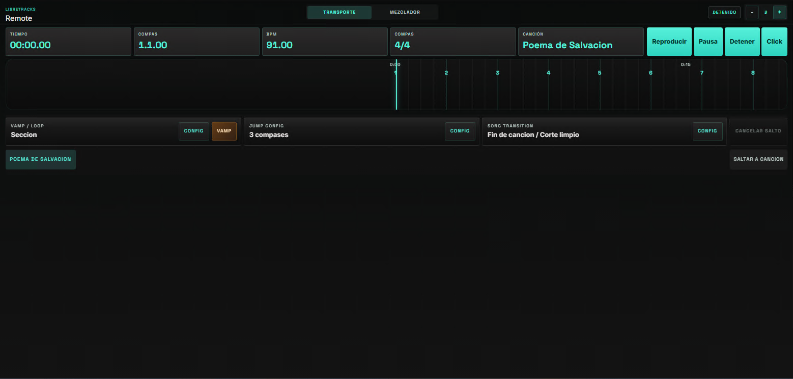
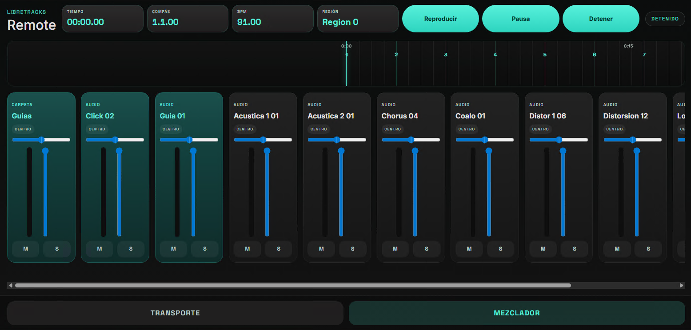

# LibreTracks User Manual

LibreTracks is designed for music directors, playback engineers, and performers who need a desktop multitrack rig that is predictable on stage. The app keeps editing non-destructive and the audio engine separate from the React UI, so arranging, saving, and performing do not depend on fragile in-place audio edits.

> ⚠️ Live tip: build your show in advance, save the project, and rehearse your jump flow with the same output device you will use on stage.

## 1. Introduction

LibreTracks lets you import WAV files, organize them into a song timeline, and trigger musical jumps between sections during playback.

Why it is safe for live use:

- Editing is non-destructive. Your original WAV files are not rewritten when you move or split clips.
- The desktop runtime keeps the audio engine separate from the UI layer.
- Transport behavior such as `Immediate`, `At next marker`, and `After X bars` is resolved by Rust-side logic instead of ad-hoc UI timing.

## 2. Audio Setup

### Open `Settings`

1. Open `Settings` from the desktop shell.
2. In the audio panel, choose the correct `Audio device`.
3. Confirm the output before rehearsal and before doors open.

If `Audio device` is left on `System Default`, LibreTracks follows the operating system default output. For a live rig, a dedicated interface is usually safer than the system default.

### Configure hardware outputs

Enable the hardware channels you want to use in `Settings > Audio`. Tracks can then route to `Master` or directly to `Ext. Out` mono channels and stereo pairs from the track header.

Typical stage use:

- Send stems and musical playback to `Master`.
- Route click, count-ins, spoken cues, or guide tracks directly to an external cue output.
- Keep cue outputs independent from the Master fader.

### Use the built-in `Metronome`

Enable `Metronome` from `Settings` when you need a reliable click without importing a separate audio file. Choose the metronome output route in settings and adjust `Metronome volume` before rehearsal so it sits correctly in the cue mix.

### Connect MIDI hardware

In `Settings`, choose a `MIDI input device` such as a pedalboard, pad controller, or keyboard. Use `Refresh MIDI devices` if the controller was connected after LibreTracks opened.

Open `MIDI Learn` to map hardware notes or CC messages to live controls. Useful mappings include `Play`, `Stop`, `Vamp`, marker jump modes, song jump triggers, song transition mode, and bar-count controls.

## 3. Project Organization

### `Library`

Use `Library` as the preparation area for your show assets.

1. Open `Library`.
2. Click `Import audio`.
3. Select one or more WAV files.
4. Drag those assets onto the timeline when you are ready to arrange them.

`Create virtual folder` helps you group assets by set, scene, song section, or instrumentation without changing the original source files. A practical setup is one virtual folder per song or per show segment.

### Import songs and packages

Use `Import song` when you want to bring another LibreTracks song/session package into the current session. You can also drag an external LibreTracks package onto the timeline. This is useful for building a show from prepared songs without rebuilding every track and marker by hand.

### `Audio track` vs `Folder track`

- `Audio track` is where clips live and play back.
- `Folder track` is for organization and grouped control of child tracks.

Use `Folder track` when you want to keep stems together, such as drums, band tracks, choirs, or background vocals. Use `Audio track` when you need a lane that actually holds clips.

## 4. Basic Editing (Timeline)

LibreTracks keeps the timeline direct and performance-oriented.

### Add and move clips

- Drag assets from `Library` to the timeline.
- On an empty arrangement, dropping from `Library` creates the first `Audio track` automatically.
- Move a clip by dragging it to a new timeline position.

### Duplicate clips

- Right-click a clip.
- Choose `Duplicate`.

This is useful for loops, repeated hits, and backing parts that need to come back later in the song.

### Split clips

1. Move the playhead or cursor to the split point.
2. Right-click the clip.
3. Choose `Split At Cursor`.

This is the fastest way to trim arrangement structure without touching the source WAV.

### Use `Snap to Grid`

Keep `Snap to Grid` enabled when you want clips, cursor moves, and edits to land on musical divisions. Turn it off only when you need a free placement that ignores the current rhythmic grid.

## 5. Live Control: Navigation and Jumps

### `Markers`

Create section markers from the ruler:

1. Right-click the ruler.
2. Choose `Create Marker`.
3. Rename the marker if needed.

LibreTracks can display markers with a numeric prefix such as `1. Intro`. In the current desktop build, the `0-9` jump shortcuts are resolved by marker order on the timeline: `0` targets the first marker, `1` the second, and so on. The data model already includes per-marker digit metadata, but a dedicated digit-assignment control is not exposed in the current UI.

### `Jump` modes

Set the global jump behavior from `Jump`:

- `Immediate`: jump right now.
- `At next marker`: wait for the current section boundary and jump at the next marker.
- `After X bars`: quantize the jump so it happens after the configured number of bars.

This lets you recover in real time if the band extends a chorus, skips a bridge, or needs to repeat a section.

### `Vamp`

Use `Vamp` to keep playback looping musically while the band or stage action needs more time. `Vamp Mode` can repeat the current `Section` or a fixed number of `Bars`. Press `Vamp` again to leave the loop.

### Song jumps and transitions

Use `Song Jump` controls when your session contains multiple song regions and you need to move to another song area during playback. The jump trigger can be immediate, after a configured number of bars, or at the song/region end.

`Song Transition` controls how the current song hands off to the next one:

- `Clean cut`: switches directly.
- `Fade out`: fades the current playback before the jump.

### Shortcuts

- `Space`: toggle `Play` / `Pause`
- `Esc`: cancel a pending jump
- `0-9`: arm a jump to the corresponding marker slot

If you arm the wrong section, press `Esc` immediately. If no marker exists for that slot, LibreTracks reports that no marker is available for that digit.

## 6. Mobile Remote Control

LibreTracks desktop can publish a mobile web remote for transport and mixer control.

### Connect your phone or tablet

1. Open `Remote` from the left navigation in the desktop app.
2. In `Connect mobile remote`, scan the QR code or open one of the provided URLs:
	- `URL by IP`
	- `URL by hostname (.local)`
3. Confirm desktop and mobile devices are on the same local network.

### Use the remote during rehearsal/show

- Use transport controls (`Play`, `Pause`, `Stop`) from the mobile view.
- Arm and cancel jumps from the remote when you need to adapt sections live.
- Toggle `Vamp`, adjust marker/song jump behavior, and select song transition mode from the remote.
- Switch to `Mixer` to adjust track volume, pan, mute, and solo without touching the desktop.

> Live workflow suggestion: keep the desktop operator focused on arrangement/timeline while a second person handles cue/mix adjustments from the remote.
