# LibreTracks User Manual

LibreTracks is designed for music directors, playback engineers, and performers who need a reliable desktop multitrack rig for live shows. The app keeps editing non-destructive and separates the audio engine from the React UI, so arranging, saving, and performing a song does not depend on modifying the original audio.

> Live tip: prepare the show in advance, save the session, and rehearse jumps with the same output device you will use on stage.

## 1. Introduction

LibreTracks lets you import audio, organize it on a timeline, and trigger musical jumps between sections during playback.

Why it is safe for live use:

- Editing is non-destructive. Original audio files are not rewritten when you move or split clips.
- The desktop runtime keeps the audio engine decoupled from the UI layer.
- Transport behavior such as `Immediate`, `At next marker`, and `After X bars` is resolved by Rust transport logic instead of improvised UI timing.

## 2. Audio Setup

### Open `Settings`

1. Open `Settings` from the side panel.
2. In the audio panel, choose the correct `Audio device`.
3. Check the output before rehearsal and before the show.

If `Audio device` is left on `System Default`, LibreTracks follows the operating system default output. For live work, using a dedicated audio interface is usually safer.

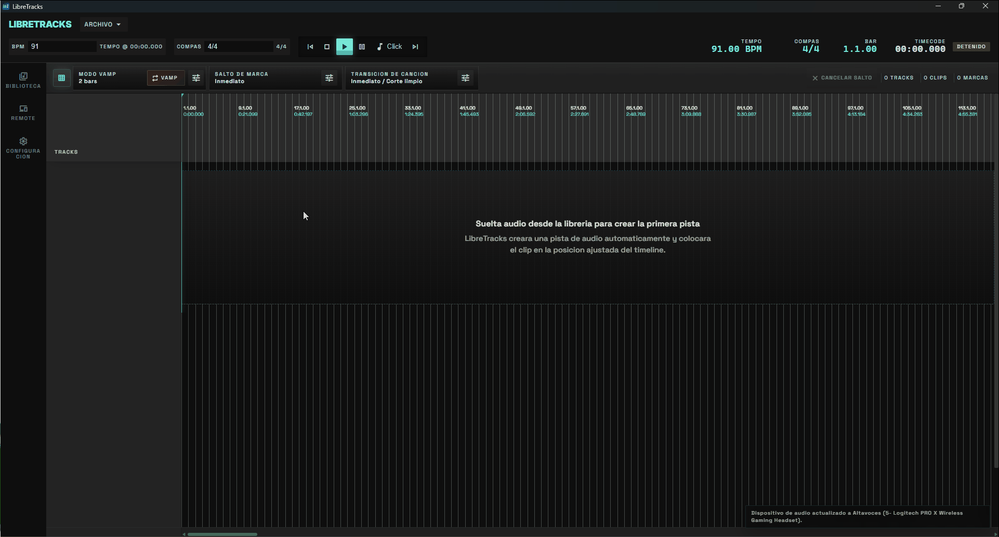

### Configure hardware outputs

Enable the hardware channels you want to use in `Settings > Audio`. Each track can route to `Master` or directly to mono and stereo-pair `Ext. Out` hardware outputs from the track header.

Typical stage use:

- Send stems and musical playback to `Master`.
- Route click, count-ins, spoken cues, or guide tracks directly to an external cue output.
- Keep cue outputs independent from the Master fader.

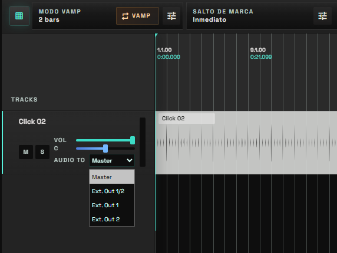

### Use the built-in `Metronome`

Enable `Metronome` from the top bar when you need a reliable click without importing a separate audio file. Choose the metronome output in settings and adjust `Metronome volume` before rehearsal so it sits correctly in the cue mix.

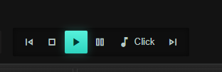

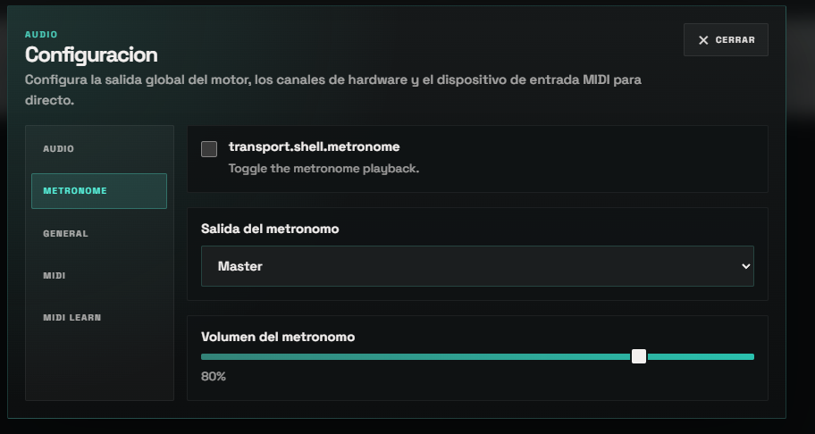

### Connect MIDI hardware

In `Settings`, choose a `MIDI input device`, such as a pedalboard, pad controller, or keyboard. Use `Refresh MIDI devices` if you connected the controller after opening LibreTracks.

Open `MIDI Learn` to assign hardware notes or CC messages to live controls. Useful mappings include `Play`, `Stop`, `Vamp`, marker jump modes, song jump triggers, song transition mode, and bar-count controls.

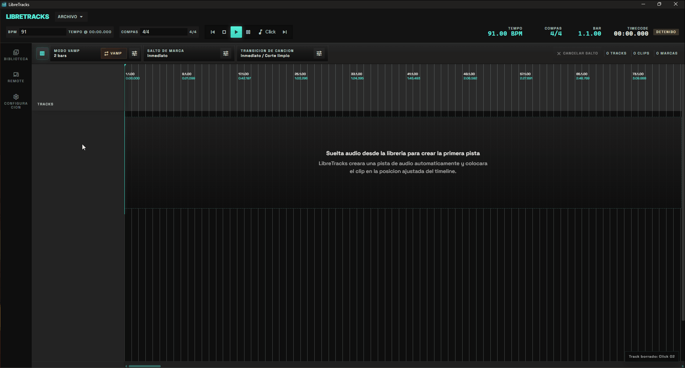

## 3. Project Organization

### `Library`

Use `Library` as the preparation area for show assets.

1. Open `Library`.
2. Click `Import audio`.
3. Select one or more audio files.
4. Drag those assets to the timeline when you are ready to arrange.

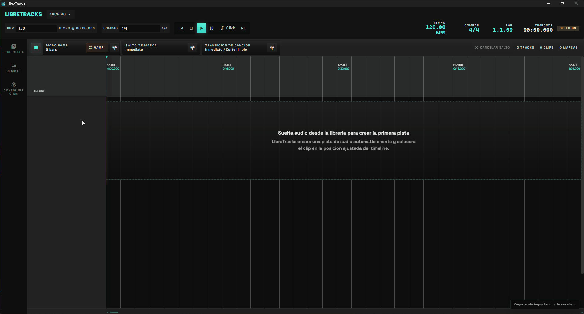

`Create virtual folder` lets you group assets by set, scene, section, or instrumentation without moving the original source files. A practical approach is to use one virtual folder per song or show block. You can create it from the `No Folder` section.

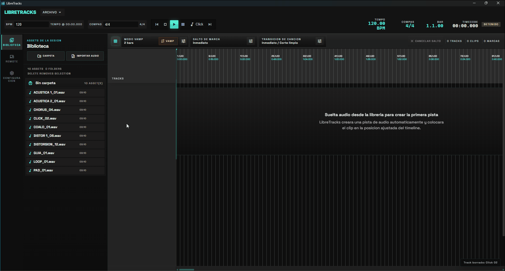

### `Audio track` vs `Folder track`

- `Audio track` is where clips live and play back.
- `Folder track` organizes and controls child tracks as a group.

Use `Folder track` when you want to group stems, such as drums, band tracks, choir, or auxiliary playback. Use `Audio track` when you need a lane that actually contains clips.

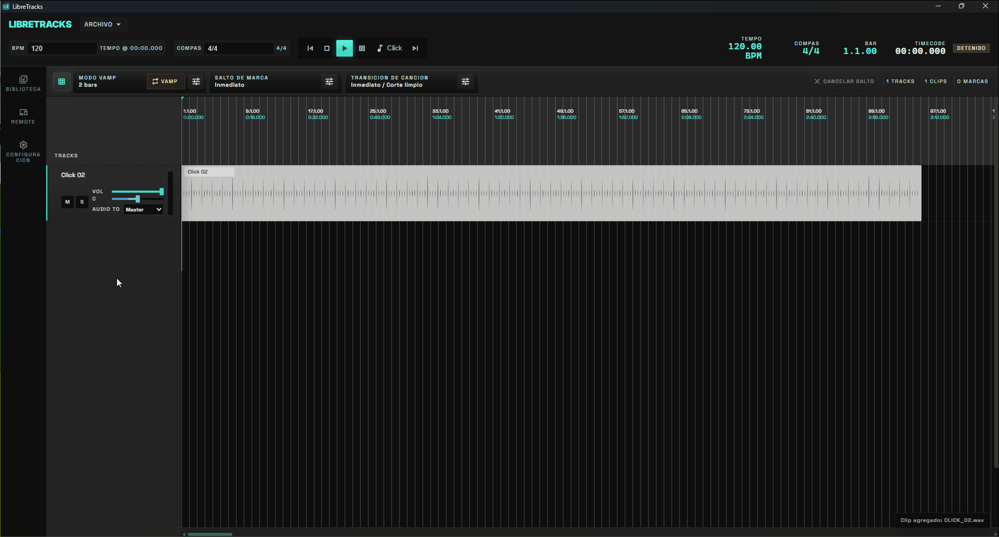

## 4. Basic Editing (Timeline)

LibreTracks keeps the timeline direct and performance-oriented.

### Add and move clips

- Drag assets from `Library` to the timeline.
- On an empty session, dropping from `Library` automatically creates the first `Audio track`.
- Move a clip by dragging it to a new timeline position.

### Duplicate clips

- Right-click the clip.
- Choose `Duplicate`.

This is useful for loops, repeated hits, and support parts that return later in the song.

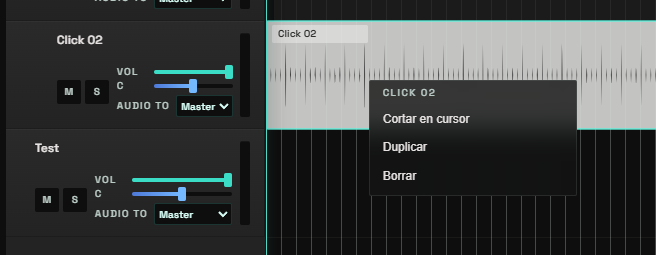

### Split clips

1. Move the cursor or playhead to the split point.
2. Right-click the clip.
3. Choose `Split At Cursor`.

This is the fastest way to adjust the arrangement without touching the original WAV.

### Use `Snap to Grid`

Keep `Snap to Grid` enabled when you want clips, cursor moves, and edits to land on musical divisions. Disable it only when you need to place something freely outside the grid.

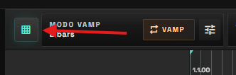

## 5. Live Control: Navigation and Jumps

### `Sections/Songs`

Sections define a song on the timeline.

Create sections from the timeline header:

1. Select the region that will become the song.
2. Right-click the region.
3. Choose `Create song from selection`.

Once created, you can rename or delete the song region.

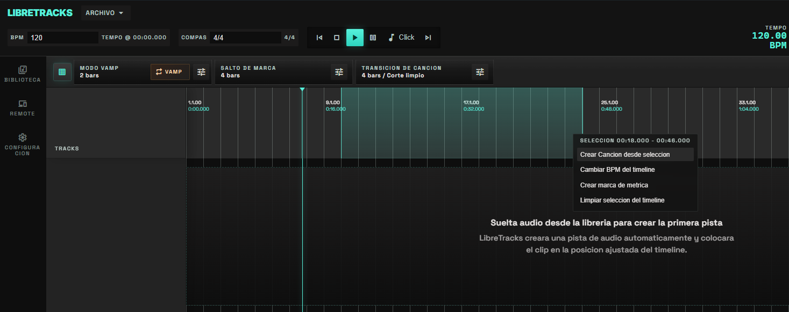

### `Markers`

Create markers from the ruler:

1. Right-click the ruler.
2. Choose `Create Marker`.
3. Rename the marker if needed.

LibreTracks can display markers with a numeric prefix such as `1. Intro`. In the current desktop build, the `0-9` shortcuts are resolved by marker order on the timeline: `0` targets the first marker, `1` the second, and so on.

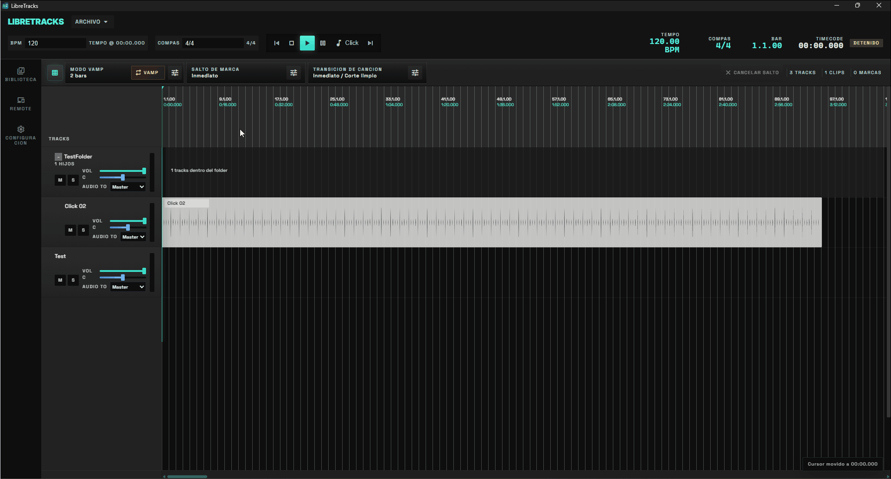

### `Time Signature Change`

You can change the time signature on the timeline:

1. Right-click the timeline header.
2. Choose `Create Meter Marker`.
3. Select the new meter using a format such as `4/4`, `3/6`, or `4/8`.

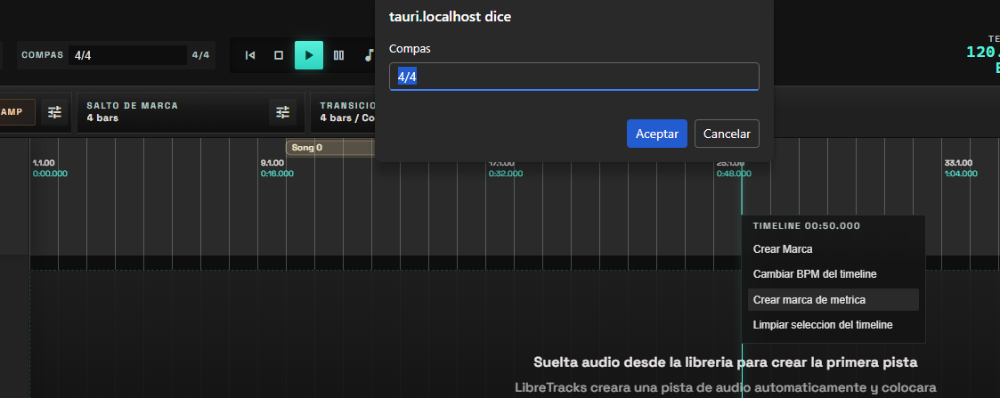

### `Jump` modes

Configure global jump behavior from `Jump`:

- `Immediate`: jump instantly.
- `At next marker`: wait for the next section boundary and jump there.
- `After X bars`: quantize the jump so it happens after the configured number of bars.

This lets you react in real time if the band extends a chorus, skips a bridge, or needs to repeat a section.

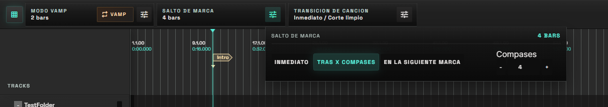

### `Vamp`

Use `Vamp` to keep playback in a musical loop when the band or stage action needs more time. `Vamp Mode` can repeat the current `Section` (sections are delimited by markers) or a fixed number of `Bars`. Press `Vamp` again to leave the loop.

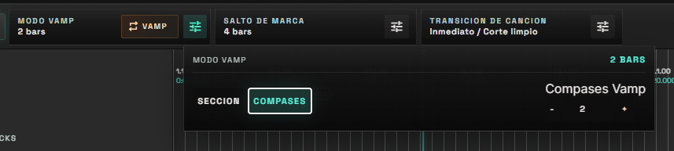

### Song jumps and transitions

Use `Song Jump` controls when the session contains multiple song regions and you need to move to another area during playback. The trigger can be immediate, after a configured number of bars, or at the end of the current song/region.

`Song Transition` controls how the current song moves to the next one:

- `Clean cut`: switches directly.
- `Fade out`: fades current playback before the jump.

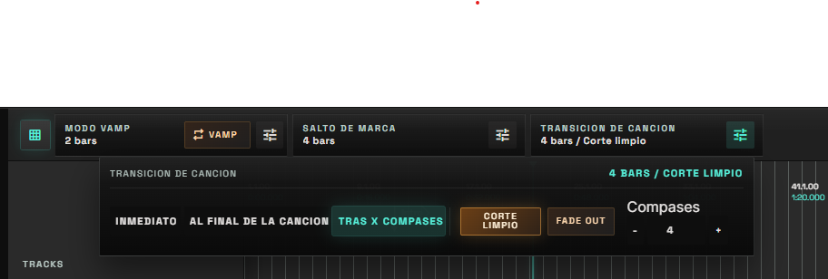

## 6. Export Songs And Packages

You can export a song after creating it as a region. The export includes the song configuration so it can be reused in future sessions.

1. Create a song from the selected region.
2. Right-click the created region.
3. Click `Export Song`.

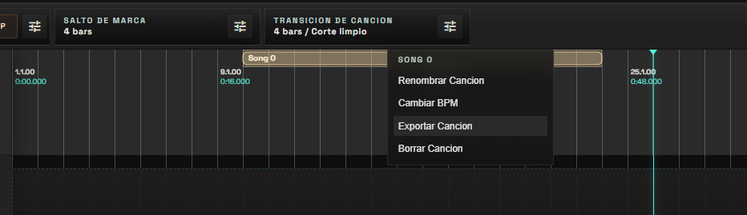

### Import songs and packages

Use `Import song` from the top `File` section when you want to bring another LibreTracks song or session package into the current session. This is useful for building a show from prepared songs without recreating tracks and markers by hand.

### Shortcuts

- `Space`: toggle `Play` / `Pause`
- `Esc`: cancel a pending jump
- `0-9`: arm a jump to the corresponding marker
- `Shift + 0-9`: arm a jump to the selected song. `0` is the first song, `1` the second, `2` the third, and so on.

If you arm the wrong section, press `Esc` immediately. If there is no marker for that slot, LibreTracks reports that no marker is available for that digit.

## 7. Mobile Remote Control

LibreTracks desktop can publish a web remote surface for transport and mixer control.

### Connect a phone or tablet

1. Open `Remote` from the side navigation in the desktop app.
2. In `Connect mobile remote`, scan the QR code or open one of the displayed URLs:
   - `URL by IP`
   - `URL by hostname (.local)`
3. Confirm the desktop and mobile device are on the same local network.

### Use the remote during rehearsal/show

- Use transport controls (`Play`, `Pause`, `Stop`) from the phone.
- Arm and cancel jumps from the remote when you need to adapt sections live.
- Enable `Vamp`, adjust marker/song jumps, and select song transition mode from the remote.
- Switch to `Mixer` to adjust volume, pan, mute, and solo per track without touching the desktop.

> Live workflow suggestion: keep the desktop operator focused on timeline/arrangement and assign cue or mix adjustments to a second person using the remote.
